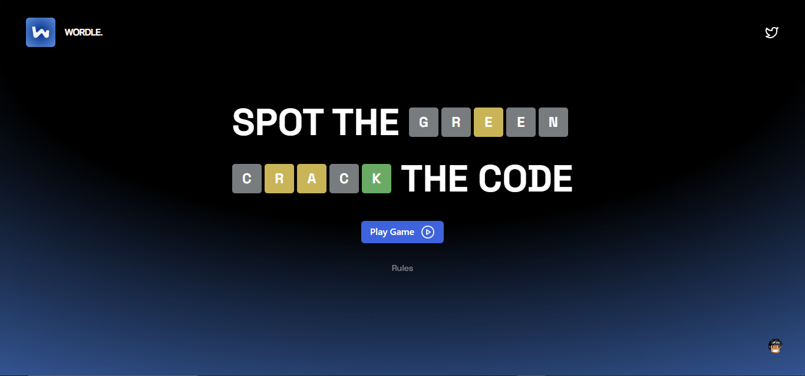

# Wordle Game


An interactive web-based word guessing game  built with React and TypeScript. Players attempt to guess a 5-letter word within six tries, receiving color-coded feedback, enhanced by animations, audio, and responsive design.

---

## Features

- **Gameplay**: Guess a 5-letter word in 6 attempts with green/yellow/gray tile feedback.
- **Responsive Design**: Adapts to desktop (fixed controls) and mobile (slide menu) layouts.
- **Audio**: Toggleable background music and success sound effects.
- **AI Hint**: One-time AI assistance feature for subtle guidance.
- **Celebratory Effects**: Confetti animation on winning, with win/lose modals.
- **Animations**: Smooth tile flips and transitions via Framer Motion.

---

## Installation

1. **Clone the repository**:
   ```bash
   git clone https://github.com/Chux-Dennis/Wordle.git
2. **Navigate to the repository**:
   ```bash
   cd Wordle
3. **Install Dependencies**:
   ```bash
   npm install
4. **Start Server**:
   ```bash
   npm run dev

## Usage
- Open the app in your browser (default: http://localhost:5173).
- Click "Play Game" on the landing page to start.
- Use the on-screen keyboard or physical keyboard to input guesses.
- Click the AI hint button (star icon) for assistance (once per game).
- Toggle sound with the volume icon.
- View rules by clicking "Rules" on the landing page.
- Win or lose to see the respective modal and choose to play again (page reloads).

## Technologies Used
- **React**: Core framework for building the UI.
- **TypeScript**: Type safety and improved code quality.
- **Tailwind CSS**: Utility-first styling.
- **Framer Motion**: Animations and transitions.
- **Ant Design (antd)**: Modals for win/lose states and hints.
- **Radix UI**: Themed buttons and components.
- **Lucide React**: Icons for UI elements.
- **React Confetti**: Victory celebration effect.

## Role
This project was developed by Chux Dennis as the sole developer, responsible for designing and implementing the responsive UI, interactive components, animations, and audio features using React, TypeScript, and various libraries to create an engaging user experience.

## License
This project is open source and under MIT License

## Contributing
Feel free to fork this repository, submit pull requests, or open issues for bugs and feature suggestions!